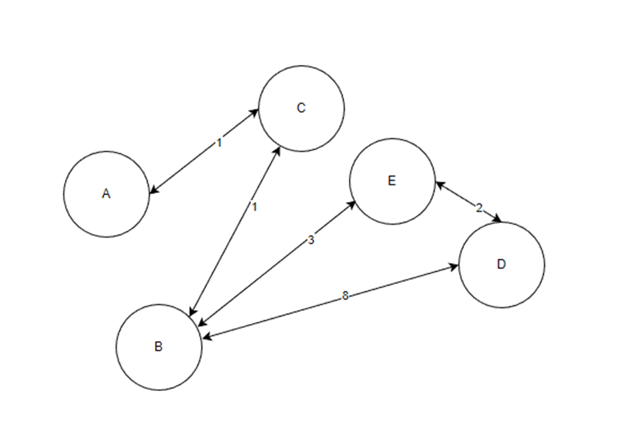

git # Genetic Algorithm in Travelling Salesman Problem
## Programming in C++ course
<p align="center" >

</p>
<h4 style="text-align: center;">Warsaw University Of Technology</h4>

## Functional requirements:
* generation of graphs and mazes with randomly generated places that need to be visited
* ability to read and write graphs from a file.
* possibility to find the shortest path between given places, passing through given places.
## Nonfunctional requirements:
* primary language C++ 17
* version control system GIT
* IDE CLion


## UML Class Diagram


## Additional Information

### Genetic Algorithm
 
- #### Main class:

```c++
    class GeneticAlgorithmForTravellingSalesmanProblem: public GeneticAlgorithm
```

- #### Genome Class:
 *in this case genome is order of veritces (spots) needed to be visited*
```c++
    class ImportantVerticesInOrder: public Genome
```
##### Important methods:
 *phenotype creation method*
```c++
    decode()    
```
*As phenotype creation function is implemented Dijkstra Algorithm*

- ### Generation Class:
 * class containing list of genomes - each occurrence represent single representative of population 
```c++
    class ImportantVerticesInOrderVariants: public Generation
```
##### Important methods:
*mutation method*

```c++
    mutation()
```

*reproduction method*

```c++
    reproduction()
```

*evaluation method*

```c++
    evaluate()
```


#### *decode()* and *evaluate()* working idea


1. Given a gene with the order of points A, B, C, D.
2. Using the Dijsktra Algorithm, we are looking for the shortest distance sequentially between A - B, B-C, C-D.
3. As a result of this procedure, a path is obtained:  A, C, B, C, B, E, D

<span style="color:#FF9900">
<i>Admittedly, the Dijsktra algorithm calculates the minimum length needed between the selected points, but due to the desire to separate the creation of the phenotype and its evaluation, the calculation of the path length will be implemented in the generation class.
Walking through the graph having a given path is not computationally demanding
</i>
</span>.
>>>>>>> d2db812 (README.md added)
